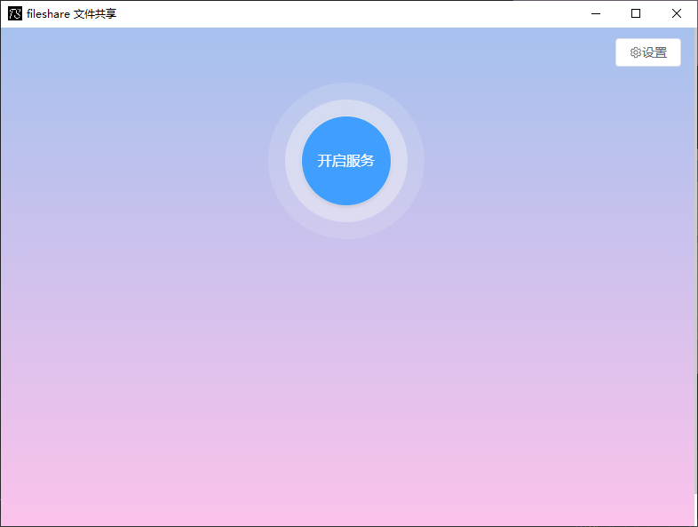
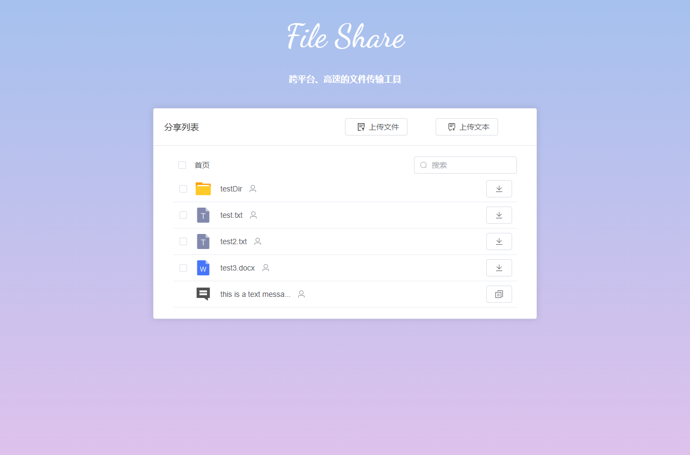

 
Languages: [简体中文](./README.md#简体中文) | [English](#english)

## English

### Introduction
**Ever transferred a file larger than 500MB? Need it urgently, and it takes hours?**

**Struggled with cross-platform file transfer? Your Mac needs to send a large file to a colleague’s Windows PC — the experience is painful.**

**File Share was created to end this nightmare.**

### Benefits
**Download speed**: Saturates bandwidth, supports resume. With multi-threaded downloaders like [Free Download Manager](https://www.freedownloadmanager.org/), your speed is limited only by how powerful your router and computer are.

**Cross-platform**: Supports Windows, macOS, Linux. Android and iOS can upload or download files via the web page.

### Downloads

|                                                                                          |                                                               |                                                                   |                                                               |                                                                |                                                                 |
|:---------------------------------------------------------------------------------------------------------------------------:|:-----------------------------------------------------------------------------------------------------:|:---------------------------------------------------------------------------------------------------------:|:---------------------------------------------------------------------------------------------------------:|:----------------------------------------------------------------------------------------------------------:|:---------------------------------------------------------------------------------------------------------:|
| [Utools](https://www.u-tools.cn/plugins/detail/FileShare%E6%96%87%E4%BB%B6%E5%85%B1%E4%BA%AB(%E5%B1%80%E5%9F%9F%E7%BD%91)/) | [MacOS x64](https://github.com/cky-thinker/file-share/releases/latest/download/fileshare-mac-x64.dmg) | [MacOS arm64](https://github.com/cky-thinker/file-share/releases/latest/download/fileshare-mac-arm64.dmg) | [Win x64](https://github.com/cky-thinker/file-share/releases/latest/download/fileshare-setup-win-x64.exe) | [Win x86](https://github.com/cky-thinker/file-share/releases/latest/download/fileshare-setup-win-ia32.exe) | [Linux x64](https://github.com/cky-thinker/file-share/releases/latest/download/fileshare-linux-amd64.deb) |

### Open Source
https://gitee.com/yuDeJiJie/file-share

https://github.com/cky-thinker/file-share

### Installation
step1: Install the Utools toolbox from https://u.tools/

step2: Search for "文件共享" (File Share) in the Utools plugin store and install the plugin.

### Usage

step1: Click "Start service" and add the files or folders you want to share.

step2: Send the share link to your friends so they can download the files.

[Utools Plugin Guide](./wiki/utools.md)

### FAQ
1. Windows share link becomes invalid — solution

Go to "Control Panel" -> "System and Security" -> "Windows Defender Firewall" -> "Advanced settings" -> "Inbound Rules". Find `utools.exe` and set all related actions to "Allow". Do this on the computer where the share link is invalid.

### Development

| Directory | Description    |
|-----------|----------------|
|page_app   | App pages      |
|page_web   | Web pages      |
|utools     | Plugin config  |
|electron   | Electron config|

### Screens
#### Start Page

#### Main Page

#### Download Page

### Release History

[Release History](wiki/releases.md)

### Star History

