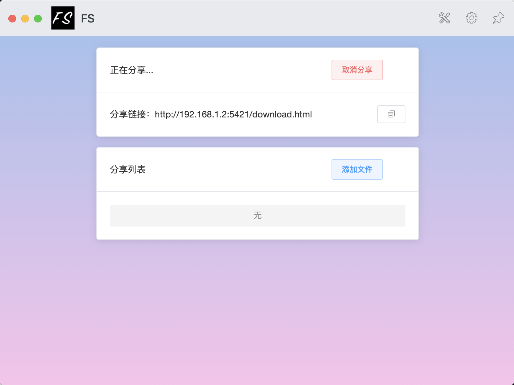

## 简介
### 经历过500M以上的大文件传输吗？紧急要用，然后文件传输要N小时!
下载速度：带宽直接打满，支持断点续传，结合Neat Download Manager之类的多线程下载器，下载速度完全取决于你的路由器和电脑有多强，下载速度就有多快！

安全隐私：很多公司软件使用还要把你文件上传他们服务器，简直流氓！本服务基于本地共享，而且代码开源，源码开放随便看！

跨平台：支持Windows，MacOS，Linux

### 同事之间传输大文件简直噩梦，file-share的诞生就是终结这个噩梦！

## 使用指南
step1：安装utools工具箱，地址： https://u.tools/

step2：在utools插件商店搜索"局域网文件共享"即可安装使用

## 开发相关
main文件夹：生成main对应的应用页面

preload文件夹：生成preload.js文件

utools文件夹：main和preload的build输出路径，插件最终基于该目录运行与打包

## 开始界面

## 运行界面

## 添加分享文件

## 通过网址下载文件

## 版本
v1.0.0功能实现：
1. 开启文件共享服务器
2. 选择共享文件
3. 根据下载链接，下载共享文件

v1.0.3功能实现：
1. 移除preload.js webpack打包逻辑，使用原生js，方便插件商店审核
