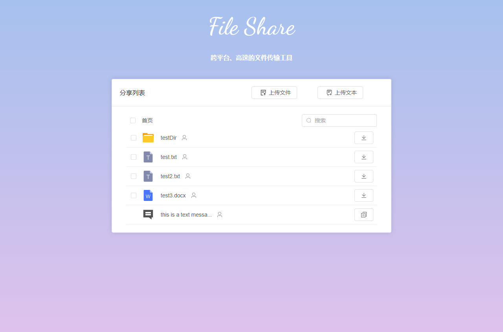

## 简介
**经历过500M以上的大文件传输吗？紧急要用，然后文件传输要N小时！**

**经历过跨平台的文件传输的痛苦吗？你的mac电脑要传一个大文件给同事的windows电脑，过程一言难尽....**

**file-share的诞生就是终结这个噩梦！**

## 优点
**下载速度**：带宽直接打满，支持断点续传，结合[Free Download Manager](https://www.freedownloadmanager.org/zh/)之类的多线程下载器，下载速度完全取决于你的路由器和电脑有多强，下载速度就有多快！

**跨平台**：支持Windows，MacOS，Linux等，Android，IOS等移动端可以通过网页上传或下载文件

## 下载地址

|  |                                                       |  |  | 
|:-----------------------------------:|:-------------------------------------------------------------------------------------------------------:|:-----------------------------------------------------------------------------------------------------:|:-----------------------------------:|
|              [点击下载](https://www.u-tools.cn/plugins/detail/FileShare%E6%96%87%E4%BB%B6%E5%85%B1%E4%BA%AB(%E5%B1%80%E5%9F%9F%E7%BD%91)/)               | [点击下载](https://github.com/cky-thinker/file-share/releases/latest/download/fileshare-mac-x64.dmg) |        [点击下载](https://github.com/cky-thinker/file-share/releases/latest/download/fileshare-setup-win-x64.exe)        |    [点击下载](https://github.com/cky-thinker/file-share/releases/latest/download/fileshare-linux-amd64.deb)    |

## 开源地址：
https://gitee.com/yuDeJiJie/file-share

https://github.com/cky-thinker/file-share

## 安装指南
step1：安装utools工具箱，地址： https://u.tools/

step2：在utools插件商店搜索"文件共享"安装插件

## 使用指南

step1：点击开启服务，并添加要共享的文件，支持文件、文件夹

step2：将分享链接发送给你的朋友，下载文件

[utools 插件指南](./wiki/utools.md)

## 使用常见问题
1. windows分享链接失效问题解决方法

通过"控制面板" -> "系统和安全" -> "Windows 防火墙" -> "高级设置" -> "入站规则" ，在其中查找utools.exe，将所有相关的操作选项设为“允许”，这个操作用在“分享链接失效”的电脑上

## 开发说明

| 目录  | 描述         |
|-----|------------|
|page_app| 应用页面       |
|page_web| web页面      |
|utools| 插件配置       |
|electron| electron配置 |

## 开始界面

## 主界面

## 下载界面

## 版本历史

[版本历史](wiki/releases.md)

## Star History

