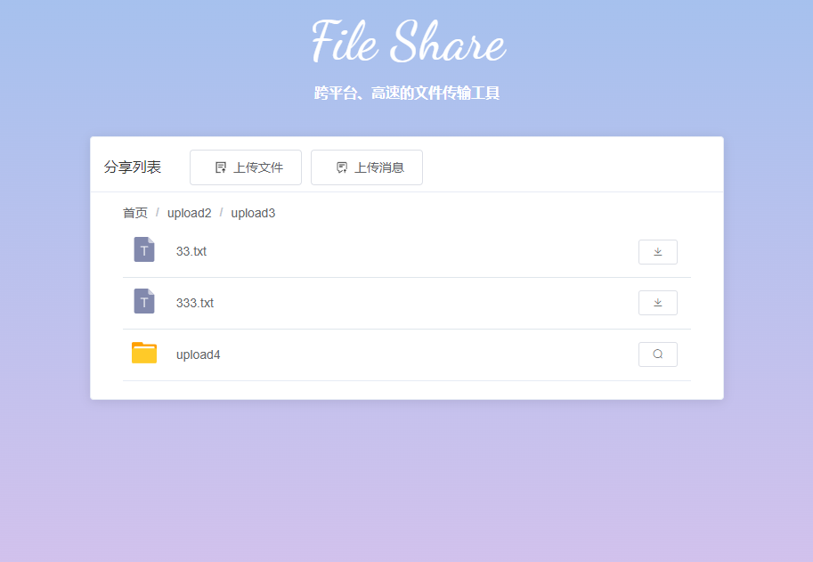

## 简介
### 经历过500M以上的大文件传输吗？紧急要用，然后文件传输要N小时！
### 经历过跨平台的文件传输的痛苦吗？你的mac电脑要传一个大文件给同事的windows电脑，过程一言难尽....
### file-share的诞生就是终结这个噩梦！

#### 优点
下载速度：带宽直接打满，支持断点续传，结合Neat Download Manager之类的多线程下载器，下载速度完全取决于你的路由器和电脑有多强，下载速度就有多快！

跨平台：支持Windows，MacOS，Linux等，Android，IOS等移动端可以通过网页上传或下载文件

安全隐私：本服务基于本地共享，代码开源，源码开放随便看！

## 开源地址：
https://gitee.com/yuDeJiJie/file-share

https://github.com/cky-thinker/file-share

## 安装指南
step1：安装utools工具箱，地址： https://u.tools/

step2：在utools插件商店搜索"文件共享"安装插件

## 使用指南

前置设置（重要）：在"我的插件应用-FileShare文件共享-设置"选择，启用“开启自动分离窗口”；见图2

step1：在utools输入框输入"文件共享"、"FS"、"FileShare"等关键词，打开文件共享工具

step2（开启“自动分离窗口”配置后可以跳过此步骤）：点击 alt + D 或 command + D 分离窗口，如果不分离窗口，窗口自动关闭后，文件共享功能也会失效

step3：点击开启服务，并添加要共享的文件，支持文件、文件夹

step4：将分享链接发送给你的朋友，下载文件

## 开发相关

page_app文件夹：应用页面

page_web文件夹：下载页面

utools文件夹：插件最终基于该目录运行与打包

## 前置设置

## 开始界面

## 主界面

## 下载界面

## 版本历史

[版本历史](wiki/releases.md)

## Star History

